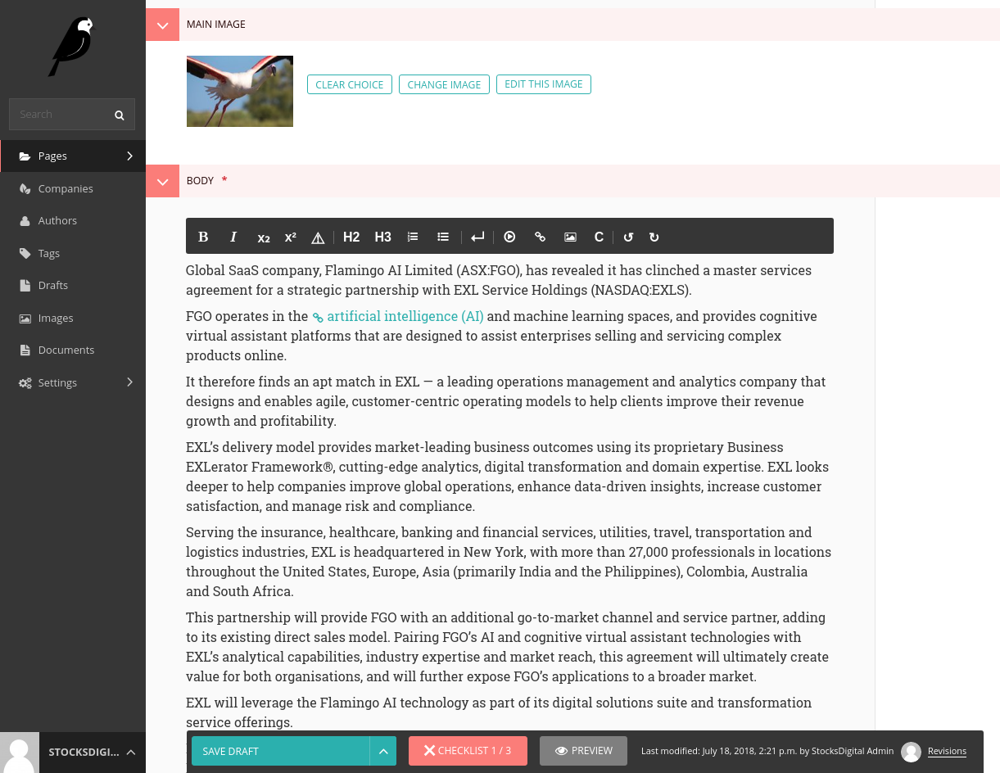
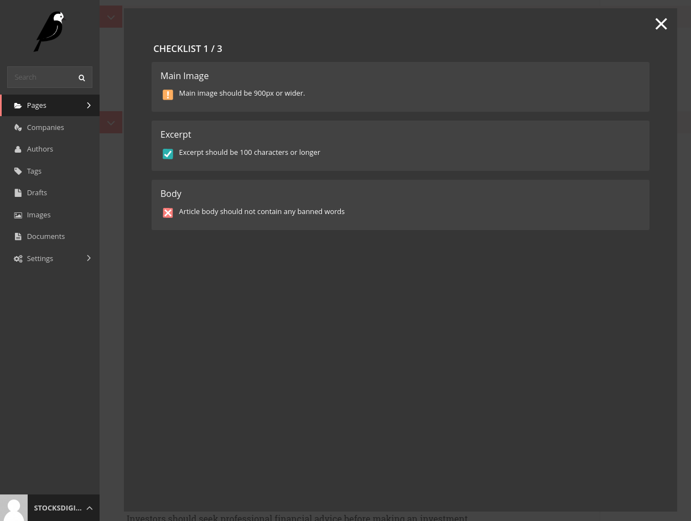

# Wagtail Checklist

This [Django](https://www.djangoproject.com/) app allows you to implement a self-validating checklist for [Wagtail](http://docs.wagtail.io/en/v2.0.1/) `Page` models.





This app provides a checklist, which is visible in the Wagtail admin. When a user edits a page, the checklist dynamically validates the current page against a set of custom validation rules (two types - errors and warnings).

Upon validation, the checklist will display any error and warning messages. A page can be published if it has warning messages, but error messages prevent publishing - you can still save a draft.  Note that this publish lock is _client-side only_.

As a developer, you can register these custom validation rules against a particular `Page` subclass.

This is useful if you want to:
  * nudge your content authors into following style rules
  * provide dynamic feedback to your authors _before_ they save the page
  * allow authors to save drafts when rules are violated, but not publish them

## Dependencies

* Wagtail (2+)
* Django (1.11+)
* Django Rest Framework (3.8+)

## Installation

In `settings.py` you need to register the app in `INSTALLED_APPS`

```python
# settings.py
INSTALLED_APPS = [
  'wagtail.core',
  'rest_framework',
  # ...
  'wagtail_checklist',
  # ...
]
```


In `urls.py` you need to add `wagtail_checklist.urls`. The base url (`wagtail_checklist/`) can be configured to be whatever you like.

```python
# urls.py
urlpatterns = [
  # ...
  path(r'wagtail_checklist/', include('wagtail_checklist.urls')),
  # ...
]
```

## Usage

Any Wagtail built in `Page` form validations (including model validations) are automatically added as rules.

You can define your own by registering a rule against a `Page` subclass.  A rule takes a `Page`, an attribute (such as a field - i.e. `title`) and the error to display if it fails (i.e. `Title is too long, should be under 100 characters`).

You can register your custom validation rules using:

* `register_error_rule` for errors, which disable publishing
* `register_warning_rule` for warnings, which only display a warning message
* `dont_check_rule` for skipping a check, including built in field validations

When a user is editing page content in the Wagtail admin, these validation rules will be run against the content.

See below for example usage:

```python
# models.py
from wagtail.core.models import Page
from wagtail_checklist.rules import register_error_rule, register_warning_rule, dont_check_rule
from django.db import models

from .banned_words import BANNED_WORDS


# The model that we are defining rules for
class Article(Page):
      # ...
      excerpt = models.CharField(max_length=300, help_text='Use 150-300 characters')
      tags = models.ManyToManyField(Tag)
      # ...


@register_error_rule(Article, 'excerpt', 'Excerpt must not contain any banned words')
def validate_excerpt_has_no_banned_words(article, parent):
    """
    Ensure we're not using any words that have been banned by legal compliance.
    """
    is_valid = not any([word in article.excerpt for word in BANNED_WORDS])
    return is_valid


@register_warning_rule(Article, 'excerpt', 'Excerpt text should be at least 150 characters')
def validate_excerpt_length(article, parent):
    """
    We want to encourage writers to use an excerpt of at least 150 characters.
    """
    is_valid = len(article.excerpt) >= 150
    return is_valid


# This will skip validation of the 'tags' field for the Article model and its subclasses
dont_check_rule(Article, 'tags')

```

Note, as per above, Wagtail's built-in `Page` form validations are also checked - validating rules like `blank=True`.  These rules also work for subclasses; for example if you register a rule for `ArticlePage`, then the rule will also be applied to its a subclass, `NewsArticlePage`.

You can disable rules by using the `dont_check_rule` function - this is useful if you want a check to work for `ArticlePage` but not `NewsArticlePage`, or you want to skip checking of a model validator (i.e. a blank title).

The decorators (`register_error_rule` and `register_warning_rule`) take 3 params:

  - page_class: the model to be validated (`Page` or `Page` subclass)
  - rule_name: the name of what is being validated (doesn't have to be a field name)
  - rule_message: an error message for when the validation fails

The decorated function must

  - accept arguments
      - page: a `Page` instance populated with form data
      - parent: an instance of `page`'s parent
  - return:
      - is_valid: `True` if the validation passed, else `False`

If the decorated function throws an exception, the decorator will log the exception and pass by default.

## How it Works

The client-side UI uses a React app, which mounts itself on the Wagtail editor's `<footer>` element. Once mounted, it regularly scrapes the current page data from the main `<form>` element and POSTs it to the backend API for validation. Validation results are then parsed and displayed.

Upon receiving a valid request, the backend API tries to construct a `Page` instance from the request. The `Page` instance is then checked against the `Page`'s built-in Wagtail form and all registered rule validation functions. Rules and form-fields that are ignored using `ignore_rule` are not checked. The results of this validation are then sent back to the frontend.

## Future Work

Frontend improvements

- ensure ordering of rules in consistent in the frontend
- display positive message when validation succeeds, only show full error messages when violated

Backend API improvements:

- should allow ignoring validation dynamically (eg. article too old)
- validation functions should be able to return dynamic error messages
- considering running validation on the before edit / create page hooks to ensure rules are validated server side

Open sourcing requirements:

- isolate JS build system
- Add a stand-alone requirements.txt
- JS frontend tests
- add example screenshots, improve docs
- add setup.py, publish to PyPI
- add license
- use non-hashed component styling to make styles overridable

## Author

Matthew Segal <matthew.segal@stocksdigital.com>
